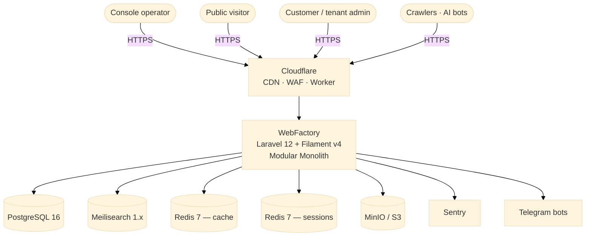
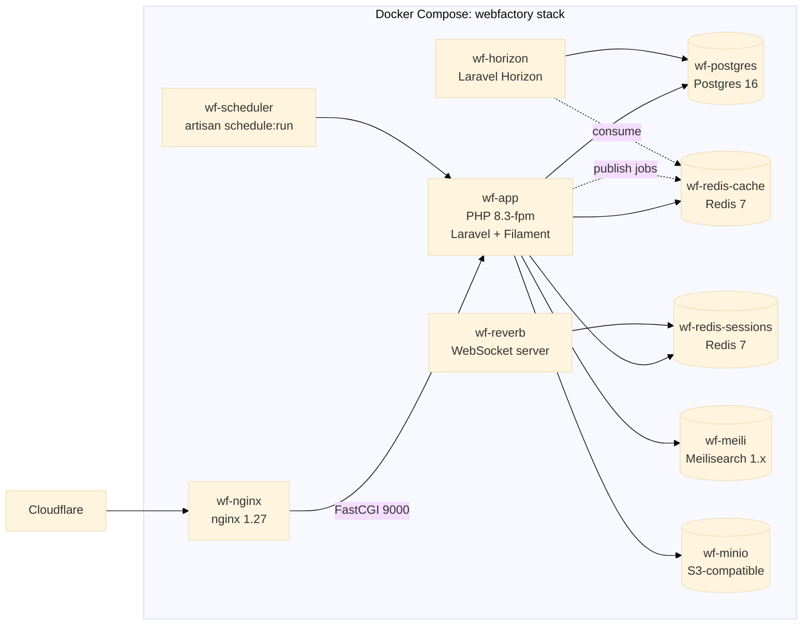

# Architecture — WebFactory

> One-page overview. Detailed specs live in `C:\Users\willi\Documents\Projets\webfactory\` (READ-ONLY).

WebFactory is a **modular monolith** written in Laravel 12 + Filament v4. It packages an admin
"console", a multi-tenant content engine, an SEO/AEO pipeline, billing and analytics, into one
codebase deployed as a single Docker Compose stack.

The architecture follows two patterns:

- **DDD bounded contexts** (Spec 27 — see ADR 0007) — 11 fixed contexts, with their own folders.
- **Hexagonal / Ports & Adapters** inside each context (ADR 0008) — Domain is framework-agnostic;
  Eloquent and HTTP live in Infrastructure.

## C4 — Level 1: System Context



## C4 — Level 2: Container view (inside the deploy unit)



## C4 — Level 3: Layered architecture inside `app/`

```mermaid
%%{init: {'theme':'base'}}%%
flowchart TB
  subgraph Presentation
    http[Http/Controllers]
    filament[Filament/Resources, Pages, Widgets]
  end

  subgraph Application
    cmd[Application/{BC}/Commands]
    qry[Application/{BC}/Queries]
    dto[Application/{BC}/DTOs]
  end

  subgraph Domain
    ent[Domain/{BC}/Entities]
    vo[Domain/{BC}/ValueObjects]
    repoiface[Domain/{BC}/Repositories<br/>interfaces only]
    svc[Domain/{BC}/Services]
    evt[Domain/{BC}/Events]
    exc[Domain/{BC}/Exceptions]
  end

  subgraph Infrastructure
    elo[Infrastructure/Persistence/Eloquent]
    repoimpl[Infrastructure/Persistence/Eloquent/Repositories]
    cache[Infrastructure/Cache]
    search[Infrastructure/Search]
    storage[Infrastructure/Storage]
    mail[Infrastructure/Mail]
    tg[Infrastructure/Telegram]
    ai[Infrastructure/Ai]
    ext[Infrastructure/External]
  end

  http-->cmd
  http-->qry
  filament-->cmd
  filament-->qry
  cmd-->svc
  cmd-->ent
  cmd-->repoiface
  qry-->repoiface
  qry-->dto
  ent-->vo
  svc-->vo
  repoimpl-->|implements|repoiface
  repoimpl-->elo
  cache-->Domain
  search-->Domain
  storage-->Domain
```

**Onion direction**: arrows always point **inward** toward Domain. Domain knows nothing about
Infrastructure or Presentation. Pest ArchTest enforces this in CI.

## 11 Bounded Contexts (canonical)

| BC | Responsibility |
|----|----------------|
| Identity | Auth, users, roles, permissions, 2FA, sessions |
| Catalog | Categories, products, services |
| Content | Pages, articles, FAQ, help, testimonials, news |
| Marketing | Tracking, conversions, growth, A/B tests |
| Billing | Subscriptions, invoices, payments, taxes |
| Communication | Notifications, email, SMS, push, Telegram |
| Search | Indexation, queries, recommendations |
| Analytics | Events, KPIs, reporting |
| Ai | Chatbot, embeddings, recommendations, copilot |
| Compliance | RGPD, audit, legal docs, consents |
| Shared | Money, Email, Url, Slug, Locale (kernel) |

Adding a 12th BC requires an ADR (see ADR 0007).

## Cross-context communication

- **Read paths** stay in-process: query handlers may call repositories from any BC.
- **Write paths** between BCs use **Domain Events** dispatched on async queues (Redis cache
  instance). This makes future extraction to a service viable if scale ever requires it (ADR 0004).

## See also

- `docs/onboarding.md` — day-1 dev setup
- `docs/adr/` — 11 architecture decision records (foundation set)
- `docker-compose.yml` — service topology
- `tests/Arch/ArchitectureTest.php` — 9 architectural rules enforced on every CI run
- `phpstan.neon` — static analysis level 8 (ADR 0011 plans the bump to 9 before Sprint 4)
